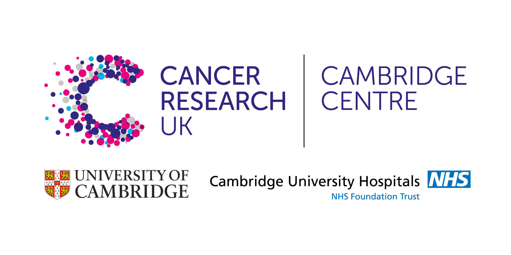

# Introduction to RNA-seq data analysis 
### 19th - 21st May 2020
#### Taught remotely
#### Bioinformatics Training, Craik-Marshall Building, Downing Site, University of Cambridge

## THIS WEBSITE IS A WORK IN PROGRESS. MATERIALS MAY NOT BE COMPLETE AND LINKS MAY NOT WORK YET

## Instructors

* Abbi Edwards - Bioinformatics Core, Cancer Research UK Cambridge Institute
* Ashley D Sawle - Bioinformatics Core, Cancer Research UK Cambridge Institute
* Chandra Chilamakuri - Bioinformatics Core, Cancer Research UK Cambridge Institute
* Dominique-Laurent Couturier - Bioinformatics Core, Cancer Research UK Cambridge Institute 
* Jon Price - Miska Group, Gurdon Institute, Cambridge
* Kamal Kishore - Bioinformatics Core, Cancer Research UK Cambridge Institute
* Manik Garg - Brazma Group, EBI
* Sankari Nagarajan - Carroll Group, Cancer Research UK Cambridge Institute
* Stephane Ballereau - Bioinformatics Core, Cancer Research UK Cambridge Institute
* Zeynep Kalender Atak - Miller Group, Cancer Research UK Cambridge Institute

## Outline

In this workshop, you will be learning how to analyse RNA-seq data.  This will
include read alignment, quality control, quantification against a reference,
reading the count data into R, performing differential expression analysis, and
gene set testing, with a focus on the DESeq2 analysis workflow. You will learn
how to generate common plots for analysis and visualisation of gene expression
data, such as boxplots and heatmaps. 

This workshop is aimed at biologists interested in learning how to perform
differential expression analysis of RNA-seq data. 

Whilst we have run this course for several years, this is the first time that
we will be teaching it remotely. Please bear with us if there are any
techinical hitches, and be aware that timings for different sections laid out
in the schedule below may not be adhered to. There may be some necessity to
make adjusments to the course as we go.

## Google Document

There is a [course Google Doc](https://docs.google.com/document/d/1CoSD_vdKrRiIu6sdC4TvIr71uUUittCTDYnc9VlTlpw/edit?usp=sharing). 

It contains useful information and links relevant to the course.

Please use it to post any questions you have during the course. The
trainers will be monitoring the document and will answer questions as quickly
as they can.

## Course etiquette

As this course is being taught onoine and there are a large number of participants,
we will alls need to follow a [few simple rules](https://docs.google.com/presentation/d/e/2PACX-1vQv9nTlsdRC9iZJU138tLL1jrwNoryp8P-FnXxb_ugOOWjbav4QHTLYLLZj2KK4kTO0_3x3VlzSdrUu/pub?start=false&loop=false&delayms=3000) to ensure things run as smoothly as possible:

1. Please mute your microphone

2. To get help from a tutor, please click the "Raise Hand" button in Zoom:

    
   
   This can be found XXXXXXXXXXXXXXXXXXXXXXXXXXXX). A tutor will then contact
   you in the chat. If necessary you and the tutor will be moved to a breakout
   room where you can discuss your issue in person.

3. Please ask any general questions by typing in them into the Google Doc mentioned above

4. During practicals, when you are done, please press the green "Yes" button: 
    
    

   this way we will know when we can move on.

## Timetable

**As we have not taught this course remotely before, all times here should be
regarded as estimates**

### Day 1

9:30 - 10:00 - [Introduction to RNAseq
Methods](html/A_Introduction_to_RNAseq_Methods.html) - Sankari Nagarajan

10:00 - 11:00 Raw read file format and QC - Abbi Edwards  
    - [Introductory slides](html/B_FastQC.html)  
    - [Practical](html/B_FastQC_practical.html)  
<!--     - [Practical solutions](html/B_FastQC_practical.Solutions.html)  -->

11:00 - 12:30 Short read alignment with HISAT2 - Ashley Sawle  
    - [Introductory slides](html/C_Alignment_with_HISAT2.html)  
    - [Practical](html/C_Alignment_with_HISAT2_practical.html)  
<!--    - [Practical solutions](html/C_Alignment_with_HISAT2.Solutions.html)  -->

12:30 - 13:30 Lunch

13:30 - 15:00 QC of alignment - Ashley Sawle  
    - [Introductory slides](html/D_QC_of_aligned_reads.html)  
    - [Practical](html/D_QC_of_aligned_reads_practical.html)  
<!--     - [Practical solutions](html/D_QC_of_aligned_reads.Solutions.html)  -->

15:00 - 16:30 Quantification with SubRead - Abbi Edwards  
    - [Introductory slides](html/E_Read_Counts_with_Subread.html)  
    - [Practical](html/E_Read_Counts_with_Subread.practical.html)  
<!--     - [Practical solutions](html/E_Read_Counts_with_Subread.Solutions.html)  -->

### Day 2

9:30 - 10:00  [Introduction to RNAseq Analysis in R](html/01_Introduction_to_RNAseq_Analysis_in_R.html)
 - Sankari Nagarajan 

10:00 - 12:00 - [RNA-seq Pre-processing](html/02_Preprocessing_Data.html) -
Stephane Ballereau  
<!--     - [Practical solutions](html/02_Preprocessing_Data.Solutions.html)   -->

13:00 - 15:00 Statistical Analysis of Bulk RNAseq Data - Dominique-Laurent  
Couturier 
    - [Slides]()  
    - [Practical]()  

15:00 - 16:00 Experimental Design of Bulk RNAseq studies - Sankari Nagaran
    - [Slides]()  
    - [Practical]()  
 
### Day 3

9:30 - 12:00 - [Differential Expression for
RNA-seq](html/04_DE_analysis_with_DESeq2.html) - Ashley Sawle   
<!--     - [practical solutions](html/04_DE_analysis.Solutions.html) -->

12:00 - 13:00 Lunch

13:00 - 15:00 [Annotation and Visualisation of RNA-seq
results](html/05_Annotation_and_Visualisation.html) - Abbi Edwards  
<!--    - [practical 
solutions](html/05_Annotation_and_Visualisation.Solutions.html) -->

15:00 - 16:00 [Gene-set testing](html/06_Gene_set_testing.html) - Ashley Sawle  
<!--     - [practical solutions](html/06_Gene_set_testing.Solutions.html) -->

> ## Prerequisites
>
> __**Some basic experience of using a UNIX/LINUX command line is assumed**__
> 
> __**Some basic R knowledge is assumed (and is essential). Without it, you
> will struggle on this course.**__ 
> If you are not familiar with the R statistical programming language we
> strongly encourage you to work through an introductory R course before
> attempting these materials.
> We recommend reading our [R crash 
course](https://bioinformatics-core-shared-training.github.io/r-crash-course/)
> before attending, which should take around 1 hour
>

## Source Materials for Practicals

The all of the lecture slides and other source materials, including R code and 
practical solutions, can be found in the course's [Github 
repository](https://github.com/bioinformatics-core-shared-training/RNAseq_May_2020i_remote)

## Extended materials

Ther materials linked to from this page are somewhat cut down from the complete
course that we normally teach. The [Extended Materials](Extended_index.md)
contain the full course materials and links to additional RNAseq materialsi
including instruction on downloading and processing the raw data for this
course, a link to an excellent R course and where to get help after the course.

## Acknowledgements

This course is based on the course [RNAseq analysis in
R](http://combine-australia.github.io/2016-05-11-RNAseq/) prepared by [Combine
Australia](https://combine.org.au/) and delivered on May 11/12th 2016 in
Carlton. We are extremely grateful to the authors for making their materials
available; Maria Doyle, Belinda Phipson, Matt Ritchie, Anna Trigos, Harriet
Dashnow, Charity Law.

